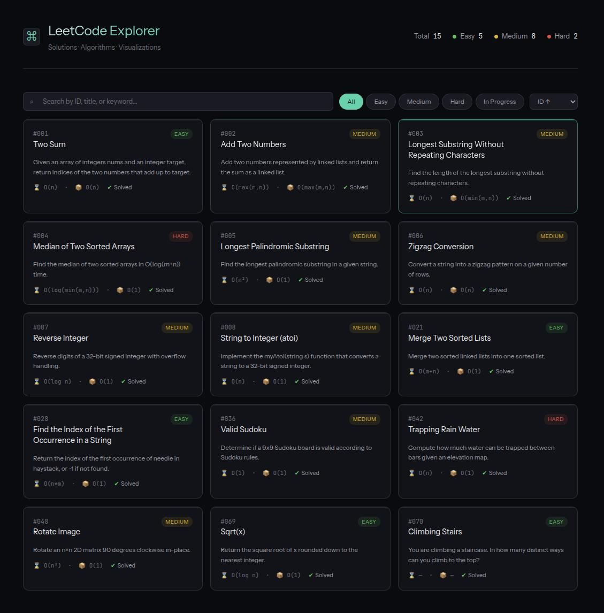

# LeetCode Explorer


> Interactive LeetCode solution site with an algorithm visualization engine for step-by-step walkthroughs.

## Preview

<div align="center">
  
  <p><em>Home page — problem browser with difficulty/tag filtering</em></p>
</div>

## Features

- **Problem Browser** — filter by difficulty and tags
- **Code Viewer** — Python solutions with one-click copy
- **Approach Notes** — step-by-step reasoning with optimization tips
- **Algorithm Visualization** — step-through and auto-play for selected problems
- **Problem Navigation** — quick prev/next switching
- **Related Problems** — knowledge graph connecting related topics
- **Agent Workflow** — Agent skill (`leetcode-sync`) to auto-update metadata when adding new solutions

## Quick Start

```bash
git clone https://github.com/kairoswong/leetcode.git
cd leetcode
# Open site/index.html directly (no server needed)
```

Optionally rebuild the data index:

```bash
python scripts/generate-index.py
```

## Project Structure

```
leetcode/
├── skills/
│   └── leetcode-sync/
│       └── SKILL.md              # Agent skill
├── site/                         # Static site
│   ├── index.html                # Problem browser
│   ├── solution-detail.html      # Detail page (code + viz)
│   ├── data/                     # JSON data files
│   └── scripts/
│       └── viz-engine.js         # Canvas visualization engine
├── solutions/                    # Python solution files
├── scripts/                      # Build & utility scripts
├── assets/
│   └── preview/                  # Screenshots for README
└── readme.md
```


## Agent Workflow

An agent skill automates metadata updates when adding solutions.

### Adding a New Solution

1. Add a `.py` file in `solutions/`
2. Run in any agent (Copilot, Claude Code, Codex):
   ```
   @leetcode-sync Add solution 15
   ```
3. The agent reads your code, analyzes it to infer difficulty, complexity, tags, and visualization steps, then updates all JSON data and rebuilds the site index.

### Metadata Files Updated

| File | Content |
|------|---------|
| `site/data/difficulties.json` | Problem difficulty (easy / medium / hard) |
| `site/data/complexities.json` | Time & space complexity |
| `site/data/descriptions.json` | One-sentence problem description |
| `site/data/approaches.json` | Solution approach / algorithm pattern |
| `site/data/insights.json` | Key insight behind the solution |
| `site/data/tags.json` | Topic tags for filtering |
| `site/data/visualizations.json` | Step-by-step viz steps for the canvas engine |

## License

BSD 3-Clause License — see [LICENSE](LICENSE). 
