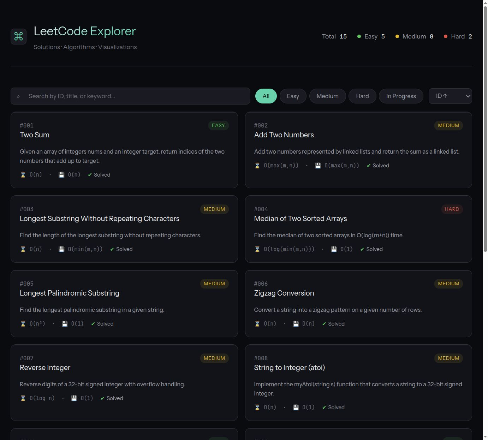

# LeetCode Explorer


> Interactive LeetCode solution site with an algorithm visualization engine for step-by-step walkthroughs.

## Preview

<div align="center">
  
  <p><em>Home page — problem browser with difficulty/tag filtering</em></p>
</div>

## Features

- **Problem Browser** — filter by difficulty and tags
- **Code Viewer** — Python solutions with one-click copy
- **Approach Notes** — step-by-step reasoning with optimization tips
- **Algorithm Visualization** — step-through and auto-play for selected problems
- **Problem Navigation** — quick prev/next switching
- **Related Problems** — knowledge graph connecting related topics

## Quick Start

```bash
git clone https://github.com/kairoswong/leetcode.git
cd leetcode
# Open site/index.html directly (no server needed)
```

Optionally rebuild the data index:

```bash
python scripts/generate-index.py
```

## Project Structure

```
leetcode/
├── site/                    # Static site
│   ├── index.html           # Problem browser
│   ├── solution-detail.html # Detail page (code + viz)
│   ├── data/                # JSON data files
│   └── scripts/
│       └── viz-engine.js    # Canvas visualization engine
├── solutions/               # Python solution files
├── scripts/                 # Build & utility scripts
├── assets/
│   └── preview/             # Screenshots for README
└── readme.md
```

## Tech Stack

| Layer | Technology |
|-------|-----------|
| Frontend | Vanilla HTML / CSS / JavaScript |
| Visualization | Custom Canvas engine |
| Backend | Python (data generation) |
| Deploy | Static site, GitHub Pages ready |

## License

BSD 3-Clause License — see [LICENSE](LICENSE). 
